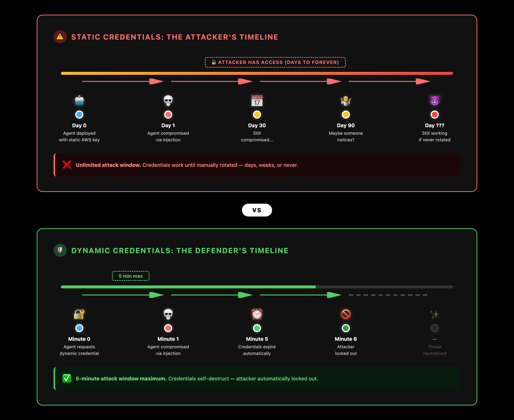
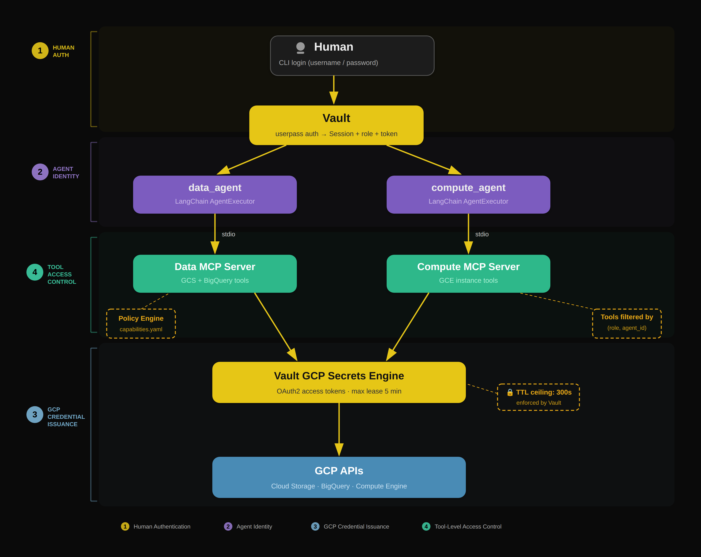

# vault-mcp-agents

This repo demonstrates mitigations for three threats from the [OWASP Top 10 for Agentic Applications (2026)](https://genai.owasp.org/resource/owasp-top-10-for-agentic-applications-for-2026/) using HashiCorp Vault-brokered, 5-minute TTL GCP credentials:

| OWASP ID | Threat | How this repo mitigates it |
|---|---|---|
| **ASI03** | **Identity & Privilege Abuse** | Vault brokers all credentials — human auth, agent identity (AppRole), and GCP tokens are issued with a hard 5-minute TTL. No long-lived keys exist on disk. |
| **ASI02** | **Tool Misuse & Exploitation** | A YAML policy maps each `(human_role, agent_id)` pair to an explicit tool allowlist. The MCP server only exposes permitted tools, so an agent cannot invoke tools outside its scope. |
| **ASI10** | **Rogue Agents** | Short-lived credentials and per-agent tool scoping contain the blast radius — a compromised agent can only reach its allowed tools, and any stolen GCP token expires within minutes. |

**Note**

Despite the fact that the credentials brokered by Vault are for GCP, the principles that this repo illustrates work
equally well for both Azure and AWS also.

## Demonstration Scenario

Two LangChain agents call separate MCP servers, where each server's capabilities are gated by the **combined identity** of the calling agent and the authenticated human user. GCP credentials are brokered through HashiCorp Vault — no long-lived service account keys exist in the application.

## Why 5-minute credentials?

Long-lived GCP credentials are a common source of security incidents. A stolen OAuth2 token that is valid for an hour gives an attacker a wide window to exfiltrate data or provision resources. By capping the credential lease at 5 minutes, this project enforces a principle of **least-duration privilege**: every GCP token issued by Vault expires before an attacker could realistically discover and exploit it through lateral movement.

The diagram below shows the contrast. In the first scenario, a compromised agent holds a static credential that never expires - the attacker has unlimited time to enumerate resources, exfiltrate data, and pivot. In the second scenario, the same compromise yields a token that expires in 5 minutes, turning a persistent backdoor into a brief, bounded incident.

<p align="center">
  
</p>

The 5-minute ceiling is enforced at two independent layers, so both must agree before a token is issued:

| Layer | Configuration | What it controls |
|---|---|---|
| **Vault GCP impersonated account** | `ttl = "300"` on each `vault_gcp_secret_impersonated_account` in Terraform | Server-side ceiling — Vault passes this as the `lifetime` to GCP's `generateAccessToken` API, so the token genuinely expires after 5 minutes |
| **Application policy** | `max_gcp_token_ttl: "5m"` in `policies/capabilities.yaml` | Client-side guard — the application policy declares the intended maximum TTL for audit and defence-in-depth |

## What this project demonstrates

| Concern | How it's handled |
|---|---|
| Human authentication | Vault userpass (pluggable to LDAP / OIDC) |
| Agent identity | Vault AppRole per agent |
| GCP credential issuance | Vault GCP secrets engine → short-lived OAuth2 tokens |
| Tool-level access control | YAML policy file mapping `(human_role, agent_id)` → allowed MCP tools |
| Agent ↔ MCP communication | MCP stdio transport with `IdentityContext` passed via environment variable |
| Agent framework | LangChain `create_tool_calling_agent` with tools adapted from MCP |

## Architecture overview

See [ARCHITECTURE.md](ARCHITECTURE.md) for diagrams and pattern descriptions.

<p align="center">
  
</p>

## Quick start

### Prerequisites

- **Python 3.11 – 3.13** (3.14 is **not** supported — see below)
- Docker (for local Vault)
- A GCP project with APIs enabled (Storage, BigQuery, Compute)
- An LLM API key (Anthropic or OpenAI)

#### Checking your Python version

```bash
python3 --version
```

If the output shows 3.14 or later, you need to use an earlier version explicitly.
On macOS with Homebrew:

```bash
brew install python@3.13
python3.13 --version   # confirm it prints Python 3.13.x
```

> **Why not Python 3.14?** Python 3.14 changed how type annotations are
> evaluated at runtime. LangChain's Pydantic-based classes trigger
> `TypeError: 'function' object is not subscriptable` during import,
> making the library unusable on 3.14+.

### 1. Start Vault

```bash
docker compose up -d
export VAULT_ADDR=http://127.0.0.1:8200
export VAULT_TOKEN=dev-root-token
```

### 2. Configure Vault

```bash
bash scripts/setup_vault.sh
```

This creates three test users (alice/operator, bob/analyst, carol/viewer) and writes Vault policies.

### 2b. Configure GCP secrets engine (Terraform)

The GCP secrets engine is provisioned via Terraform, which creates a GCP service account, grants it the necessary IAM roles, and configures Vault — with no service-account key file on disk.

**Prerequisites:**
- [Terraform](https://developer.hashicorp.com/terraform/install) >= 1.5
- `gcloud` CLI authenticated: `gcloud auth application-default login`

```bash
cd terraform
cp terraform.tfvars.example terraform.tfvars
# Edit terraform.tfvars — set gcp_project_id to your GCP project
terraform init
terraform apply
```

You must also set the same GCP project ID in `config/settings.yaml` so that the MCP data server can pass it to the GCS and BigQuery clients:

```yaml
# config/settings.yaml
gcp:
  project_id: "your-gcp-project-id"   # must match terraform.tfvars
  region: "us-central1"
```

> **Why is this needed?** The data agent uses OAuth2 access tokens from Vault
> rather than service account key files. Unlike key-based credentials, OAuth2
> tokens do not carry project metadata, so the GCP client libraries cannot
> infer the project automatically. The project ID in `settings.yaml` is
> passed through the `IdentityContext` to every GCS and BigQuery client call.

This creates:
- A GCP service account for Vault itself (`vault-gcp-secrets@<project>.iam.gserviceaccount.com`)
- IAM bindings for `serviceAccountAdmin`, `serviceAccountKeyAdmin`, `serviceAccountTokenCreator`, and `projectIamAdmin`
- Dedicated GCP service accounts for each agent (`data-agent-gcp`, `compute-agent-gcp`) with their respective IAM roles
- Vault GCP secrets engine with two **impersonated accounts** (`data-agent-gcp` and `compute-agent-gcp`), each configured with a **5-minute token TTL** (`ttl = "300"`)

To tear down: `terraform destroy`. See [`terraform/README.md`](terraform/README.md) for full details.

### 3. Create and activate a virtual environment

```bash
python3.13 -m venv .venv
source .venv/bin/activate      # Linux / macOS
# .venv\Scripts\activate       # Windows
```

You must activate the virtual environment in every new shell session before
running or developing the project:

```bash
source .venv/bin/activate
```

### 4. Install

```bash
pip install -e ".[dev]"
```

### 5. Set LLM API key

```bash
export ANTHROPIC_API_KEY=sk-ant-...
# or
export OPENAI_API_KEY=sk-...
```

### 6. Configure the config/settings.yaml file

Add your GCP project id to the config/settings.yaml file, this is an excerpt from the bottom of the file
where this goes:
```
# GCP project default
gcp:
  project_id: "<Your GCP project id goes here>"
  region: "us-central1"
```

### 7. Run

```bash
vault-mcp-agents
# or
python -m vault_mcp_agents.main --verbose
```

You will be prompted to log in, select an agent, and then interact with it in natural language.

The setup script (`scripts/setup_vault.sh`) creates three preconfigured users with different access levels:

| Username | Password | Role | Access Level |
|---|---|---|---|
| `alice` | `alice-pass` | operator | Full read/write/delete access to all GCP tools |
| `bob` | `bob-pass` | analyst | Read-only GCS + BigQuery, limited compute |
| `carol` | `carol-pass` | viewer | Minimal read-only data access |

### 8. Run tests

```bash
pytest -v
```

Tests for the policy engine, session, and identity context run without Vault or GCP.

## Testing the 5-minute credential lease

### How to verify

There are three levels of verification, from a fast unit test to a full end-to-end proof.

#### Level 1: Unit tests (no infrastructure required)

The test suite validates that the policy engine resolves `"5m"` for every role:

```bash
pytest tests/test_policy_engine.py -v -k "five_minute"
```

This runs `test_all_roles_get_five_minute_ttl`, which asserts that operator, analyst, and viewer all receive `max_gcp_token_ttl == "5m"`.

#### Level 2: Vault CLI (requires running Vault + GCP secrets engine)

Read a token directly from Vault and inspect the reported TTL:

```bash
export VAULT_ADDR=http://127.0.0.1:8200
export VAULT_TOKEN=dev-root-token

# Request a token from the data-agent impersonated account
vault read gcp/impersonated-account/data-agent-gcp/token
```

The response includes a `token_ttl` field. With the 5-minute configuration, this value will be `300` (seconds) or less.

You can also confirm the impersonated account configuration:

```bash
vault read gcp/impersonated-account/data-agent-gcp
```

The `ttl` field should show `5m` (or `300s`).

#### Level 3: End-to-end proof (requires Vault + GCP project)

This test obtains a real GCP token via Vault, uses it immediately, waits for it to expire, and confirms that GCP rejects the stale token:

```bash
source .venv/bin/activate
python - <<'PYEOF'
import subprocess
import time
import hvac
from google.oauth2.credentials import Credentials
from google.cloud import storage

# --- Step 0: Get GCP project ID from gcloud ---
project_id = subprocess.run(
    ["gcloud", "config", "get-value", "project"],
    capture_output=True, text=True, check=True,
).stdout.strip()
print(f"GCP project: {project_id}")

# --- Step 1: Get a short-lived token from Vault ---
client = hvac.Client(url="http://127.0.0.1:8200", token="dev-root-token")
resp = client.secrets.gcp.generate_impersonated_account_oauth2_access_token(
    name="data-agent-gcp", mount_point="gcp"
)
token = resp["data"]["token"]
ttl   = resp["data"].get("token_ttl", "unknown")
print(f"Vault issued token with TTL: {ttl}s")
assert int(ttl) <= 300, f"TTL {ttl}s exceeds 5-minute ceiling!"

# --- Step 2: Use the token immediately (should succeed) ---
creds = Credentials(token=token)
sc = storage.Client(credentials=creds, project=project_id)
buckets = [b.name for b in sc.list_buckets()]
print(f"T+0s:   SUCCESS — found {len(buckets)} bucket(s)")

# --- Step 3: Wait past expiry ---
wait = int(ttl) + 10
print(f"Waiting {wait}s for token to expire...")
time.sleep(wait)

# --- Step 4: Retry with the same token (should fail) ---
try:
    sc2 = storage.Client(credentials=creds, project=project_id)
    list(sc2.list_buckets())
    print("T+expired: UNEXPECTED SUCCESS — token should have expired")
except Exception as e:
    print(f"T+expired: EXPECTED FAILURE — {type(e).__name__}: {e}")
PYEOF
```

A successful test run looks like:

```
GCP project: my-gcp-project
Vault issued token with TTL: 300s
T+0s:   SUCCESS — found 3 bucket(s)
Waiting 310s for token to expire...
T+expired: EXPECTED FAILURE — Forbidden: ...
```

## Project structure

```
vault-mcp-agents/
├── config/
│   └── settings.yaml              # Vault, agent, MCP, LLM configuration
├── policies/
│   └── capabilities.yaml          # (role, agent) → allowed tools
├── scripts/
│   └── setup_vault.sh             # Vault dev provisioning (auth, policies, users)
├── terraform/
│   ├── main.tf                    # GCP SAs + Vault GCP secrets engine + impersonated accounts
│   ├── variables.tf               # Input variables (project ID, region, etc.)
│   ├── outputs.tf                 # Impersonated account names, SA email
│   ├── versions.tf                # Provider version constraints
│   ├── terraform.tfvars.example   # Template for local variable values
│   └── README.md                  # Terraform-specific usage guide
├── src/vault_mcp_agents/
│   ├── main.py                    # CLI entry point
│   ├── auth/
│   │   ├── vault_authenticator.py # Human login via Vault
│   │   └── session.py             # Immutable session context
│   ├── vault/
│   │   └── gcp_credentials.py     # GCP token retrieval from Vault
│   ├── policy/
│   │   └── engine.py              # YAML policy resolution
│   ├── mcp/
│   │   ├── identity_context.py    # Composite identity (agent + human)
│   │   ├── base_server.py         # Base MCP server with tool filtering
│   │   ├── data_server.py         # GCS + BigQuery MCP tools
│   │   └── compute_server.py      # GCE Compute MCP tools
│   ├── agents/
│   │   ├── factory.py             # Builds LangChain agents from config
│   │   └── mcp_langchain_adapter.py # MCP tools → LangChain tools
│   └── prompt/
│       └── cli.py                 # Interactive login + conversation UI
├── tests/
│   ├── conftest.py                # Shared fixtures
│   ├── test_policy_engine.py      # Policy resolution tests
│   ├── test_session.py            # Session behaviour tests
│   ├── test_identity_context.py   # Serialisation round-trip tests
│   └── test_capability_filter.py  # End-to-end capability filtering
├── docker-compose.yaml
└── pyproject.toml
```

## Customisation

### Adding a new MCP tool

1. Add the handler method to the relevant server (`data_server.py` or `compute_server.py`).
2. Register it in `_register_all_tools()`.
3. Add the tool name to the appropriate roles in `policies/capabilities.yaml`.
4. Tests for the policy engine will catch any missing entries.

### Adding a new role

1. Create a Vault policy (e.g. `auditor-policy`).
2. Add the role mapping in `vault_authenticator.py` → `_POLICY_TO_ROLE`.
3. Add a `auditor:` block to `policies/capabilities.yaml` with per-agent tool lists.

### Switching auth methods

Change `vault.auth_method` in `settings.yaml` to `ldap` or `oidc`. The `VaultAuthenticator` delegates to the corresponding `hvac` auth backend.

## Troubleshooting

### `ModuleNotFoundError: No module named 'vault_mcp_agents'`

This error occurs when running `python -m vault_mcp_agents.main` without an
active virtual environment or without having installed the package first.

**Fix:** create and activate a virtual environment, then install the package:

```bash
python3.13 -m venv .venv
source .venv/bin/activate
pip install -e ".[dev]"
```

If you already have the `.venv` directory, you just need to activate it:

```bash
source .venv/bin/activate
```

> **Why is a venv required?** Homebrew-managed Python on macOS is
> [externally managed](https://peps.python.org/pep-0668/) and blocks
> system-wide `pip install`. A virtual environment isolates the project's
> dependencies and makes the `vault_mcp_agents` package importable.

## License

MIT
